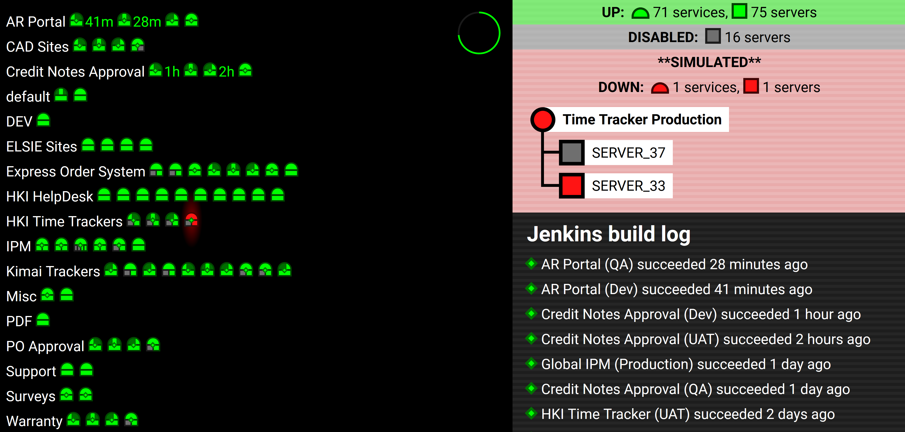

# Sites monitor

This is a site-status dashboard that my team projects on one wall of our office. It uses React to visualize data from Jenkins and from our Barracuda load balancer. It provides cheerful reassurance that all our sites are still up; if one of them goes down, it lets us know which site has gone down and which servers are responsible. It's designed to monitor a large number of sites with **no interaction** -- when something goes wrong it will tell you where to look without a single keypress or mouse click.

Each circle is a site/service; each rectangle is one of the servers holding it up. Each diamond is a Jenkins build. If something turns red, it has failed and you should go fix it. Data is fetched from the `loadBalancerUrl` and the `jenkinsUrl` (on lines 9-10 of src/App.jss) every 30 seconds. Data has been cached for this public demo.

Run `npm start` to start the development server. `npm run build` will build it for production.

## Important files in /src

- **App.jsx:** All the networking and data-processing logic, and the app's overall layout.
- **App.scss:** Stylesheet
- **System.jsx:** React component visualizing a System, which is a service (site) and the servers that keep it live. Systems may also show a diamond that represents the most recent Jenkins build (defined in Diamond.jsx). Systems are organized into Groups defined by the load balancer.
- **JenkinsLog.jsx:** Displays recent builds from Jenkins. The number of recent builds is determined by `const numJenkinsBuildsToShow` in App.jsx.
